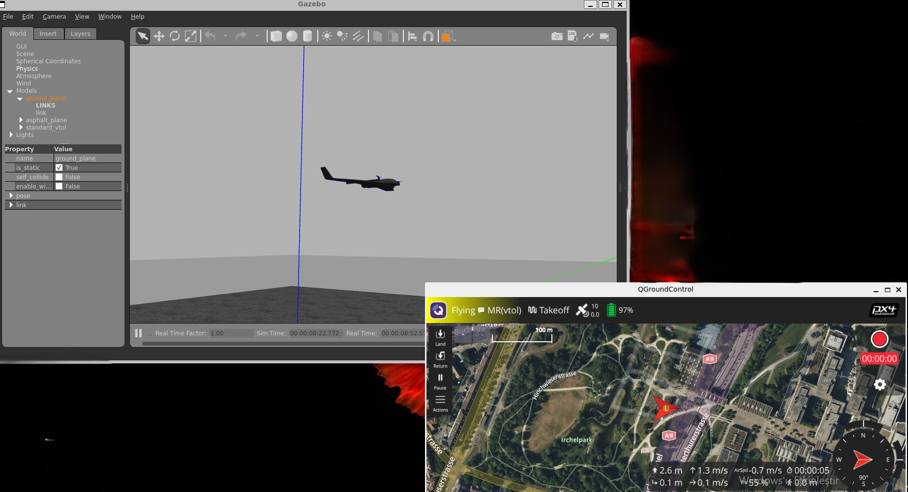
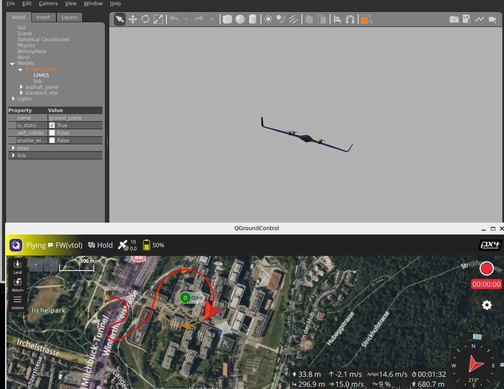
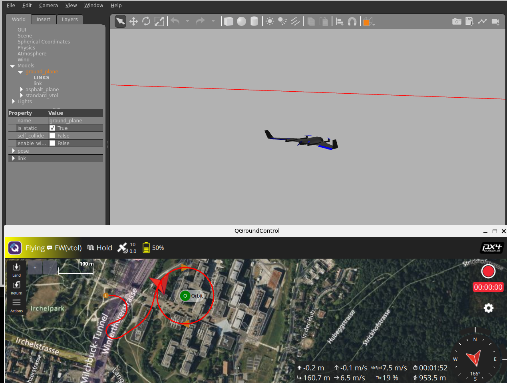

# VTOL Otonom Dalış Sistemi (Gazebo FSM)

Bu proje, PX4 ve MAVSDK (Python) kullanılarak Gazebo simülasyon ortamında VTOL (Dikey Kalkış ve İniş) yetenekli insansız hava araçları için otonom uçuş ve hedefe kilitli dalış senaryosunu gerçekleştirmek amacıyla geliştirilmiştir. 

Sistem mimarisi, uçuşun farklı evrelerini güvenli bir şekilde yönetebilmek için bir Sonlu Durum Makinesi (Finite State Machine - FSM) üzerine kurulmuştur.

## 📌 Proje Özellikleri

* **Otonom Kalkış (Takeoff):** Hedeflenen irtifaya multicopter modunda stabil tırmanış.
* **Mod Geçişi (Transition):** İstenen irtifa ve hıza ulaşıldıktan sonra sabit kanat (fixed-wing) aerodinamik uçuş moduna otonom ve güvenli geçiş.
* **Hedefe Yönelim (Mission):** Dinamik olarak girilen GPS (Enlem/Boylam) koordinatlarına otonom intikal.
* **Kararlı Dalış ve İniş (Landing):** Hedef bölge çapına girildiğinde multicopter moduna dönüş, irtifa kaybını önleyici askıda bekleme (hover) ve hız/irtifa kontrollü kilitli dalış.

## 📂 Depo Yapısı

\`\`\`text
vtol-gazebo-fsm/
├── assets/
│   ├── fixed_wing_flight.jpg
│   ├── takeoff.jpg
│   └── target_approach.jpg
├── src/
│   └── main.py
├── .gitignore
├── README.md
└── requirements.txt
\`\`\`

## 📸 Simülasyon Görüntüleri

### Kalkış ve Mod Geçişi
Aşağıdaki görselde aracın multicopter modunda kalkış yaptığı ve sabit kanat moduna geçişe hazırlandığı aşama görülmektedir.

### Otonom Sabit Kanat Uçuşu
Araç sabit kanat moduna geçtikten sonra hedefe doğru seyir halindeyken.

### Hedefe Yaklaşma ve Yörüngeye Girme
QGroundControl üzerinden aracın hedef koordinatlara ulaşması ve dalış öncesi hedef üzerinde konumlanması.

## ⚙️ Kurulum ve Gereksinimler

Projenin çalışabilmesi için sisteminizde Python 3.x, PX4-Autopilot ve Gazebo kurulu olmalıdır. Python bağımlılıklarını kurmak için depo ana dizininde aşağıdaki komutu çalıştırın:

\`\`\`bash
pip install -r requirements.txt
\`\`\`

## 🚀 Çalıştırma Adımları

Simülasyon ortamını ve otonom görev kodunu ayağa kaldırmak için iki ayrı terminal kullanılması gerekmektedir.

**1. Terminal (PX4 ve Gazebo Başlatma):**
PX4 kaynak kodlarının bulunduğu dizine giderek simülasyonu başlatın:
\`\`\`bash
cd ~/PX4-Autopilot
make px4_sitl gazebo_standard_vtol
\`\`\`

**2. Terminal (Otonom Görev Kodunu Çalıştırma):**
Proje dizinine giderek Python scriptini çalıştırın:
\`\`\`bash
cd ~/vtol-gazebo-fsm
python3 src/main.py
\`\`\`

Program başladığında, terminal üzerinden dalış yapılacak hedefin Enlem (Latitude) ve Boylam (Longitude) değerleri istenecektir. Koordinatlar girildikten sonra görev otonom olarak başlayacaktır.